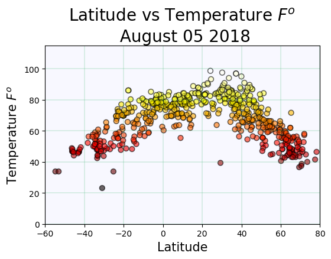

# WeatherPy

I chose to employ data analytics to answer this question, and visualize the results. 
First, I used the Random module in Python to uniformly select Latitudes between -90.000 to 90.000, and Longitudes
from -180.000 to 180.000. I generated 2000 unique coordinate pairs. 
Second, I used the Citipy module to find the nearest city to each coordinate pair, and eliminated any duplicates.
This left me with an unbiased sample of 637 cities.
Third, I queried the OpenWeatherMap website to get relevant data for each city such as: temperature, % humidity, % cloudiness,
wind speed.
Finally, I used pandas and matplotlib to create a DataFrame and visualize the results.

# Analysis
There is a clear correlation of latitude to temperature. As the latitudes approach the extreme values, the temperature
decreases, with the highest temperatures found at 35 degrees. With a larger data set, the trend could lean more to 
higher temperatures closer to zero degrees. 
As for % humidity and the other graphs made, there is no correlation to be found based on latitude. There is an even
distribution of humidity, cloudiness and wind speed accross all the latitudes. 

